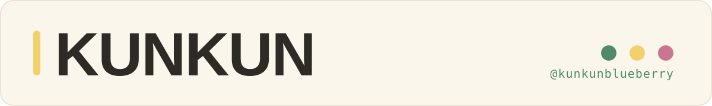
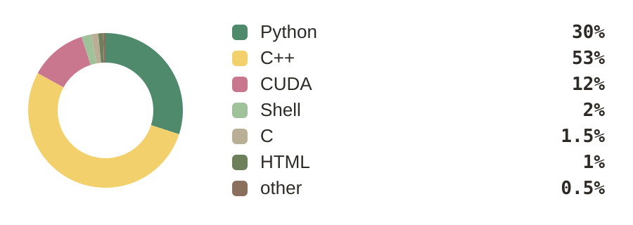

<!--
  kunkunblueberry/kunkunblueberry — profile README
  Entry point only — details live in the repos and PRs.
-->

  

  <b>AI Systems / LLM Inference · vLLM / vLLM-Omni · C++ / CUDA / Python</b> 
  From CUDA kernels and a hand-built runtime up to vLLM upstream — source first, minimal scope, verified changes.

  

### Selected Work

- **LLM Inference Systems** — built and optimized inference runtimes across scheduling, KV cache, memory management, and model execution · `C++ / CUDA / Python`
- **Prefix Cache & Cross-Stage Inference** — designed cache lifecycle and state-management abstractions for cross-stage intermediate-state reuse in multimodal inference · `vLLM / vLLM-Omni`
- **Multimodal Serving & Scheduling** — worked on cross-stage execution, request batching, and scheduling for autoregressive and diffusion pipelines · `Distributed Inference / PyTorch`

### Open Source

- **[vllm-project/vllm-omni](https://github.com/vllm-project/vllm-omni)** — cross-stage inference, prefix caching, batching, and image-generation infrastructure · `#7902 #7920 #8134 #8174`
- **[ThinkFlowLab/vllm-rlt](https://github.com/ThinkFlowLab/vllm-rlt)** — integrated Nanbeige4.2 with PD serving and identified model/serving integration issues · `#77`

### Contribution Graph

<picture>
  <source media="(prefers-color-scheme: dark)" srcset="https://raw.githubusercontent.com/kunkunblueberry/kunkunblueberry/output/github-contribution-grid-snake-dark.svg">
  <source media="(prefers-color-scheme: light)" srcset="https://raw.githubusercontent.com/kunkunblueberry/kunkunblueberry/output/github-contribution-grid-snake.svg">
  
</picture>

<!-- 3D 图里 action 自带一个按仓库主语言统计的饼图，会把这个 profile 讲反（见 .github/strip-lang-pie.py），
     workflow 已把它剥掉。URL 末尾的 ?v= 是 cache-buster：camo 按 URL 做缓存，改了图内容必须换一个 v 值，
     否则页面会继续显示旧图。 -->

### Elsewhere

| | |
| :-- | :-- |
| **GitHub** | **[@kunkunblueberry](https://github.com/kunkunblueberry)** |
| **Email** | **[1833921874@qq.com](mailto:1833921874@qq.com)** |
